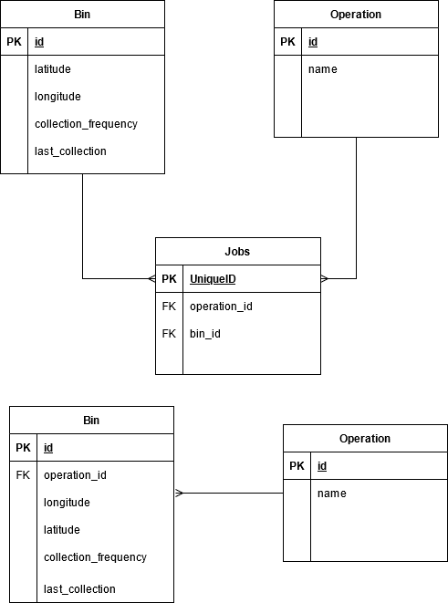

<h1 align="center">
    Evreka Backend Case Study
</h1>

## Question 1:
To reach desired function in first question, you can go to `question1 > views.py`
In `views.py` file, there is an GET endpoint which is include query from QuerySet API of Django ORM
for first question.

First of all, instead of going to the desired result using the QuerySet API in Django ORM, 
the queries created by Django can be examined to see if better results can be obtained by 
sending a raw SQL query.

Also, in order to reduce the load on the NavigationRecord model, the Last Location and Last Time
fields can be added in the Vehicle model and the query can be performed on the Vehicle table
without any filtering. A NoSQL database can be preferred for this type of data, as it will not
be cost effective to constantly update the location and date information on the RDBMS. In this
way, when a new NavigationRecord arrives vehicle last point and time will be updated and the
needed information of the vehicles can be accessed instantly.

## Question 2:



I decided to create two separate ER diagrams. First one is a design that can be used if there is a many
to many relationship between the Bin and Operation models that I have created at the top.
If there will be situations where one Bin entity can able to have relation with multiple operation entities, I would prefer
this design. The model table named Jobs in design that I mentioned helps us to establish this relation
by creating the interaction between the two tables.

In the second ER design, below one, I created the operation_id(FK) field as a Foreign Key
in the Bin model in order to assign Bin entities to their specific operation. 


I prepared SQL queries as a wanted functions. These SQL queries can be executed in python functions.
Hope I didn't take the wrong approach.

- #### Function for first design

```sql
SELECT j.bin_id as bin, j.operation_id as operation, b.collection_frequency 
FROM Jobs as j
LEFT JOIN Bin as b
ON j.bin_id = b.id
```

- #### Function for second design

```sql
SELECT b.id as bin, b.operation_id as operation, b.collection_frequency 
FROM Bin as b
LEFT JOIN Operation as o
ON b.operation_id = o.id
```
